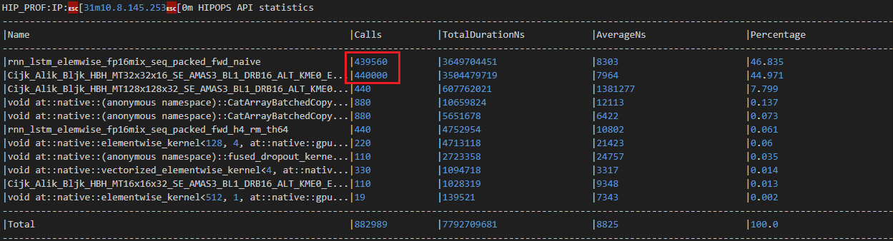
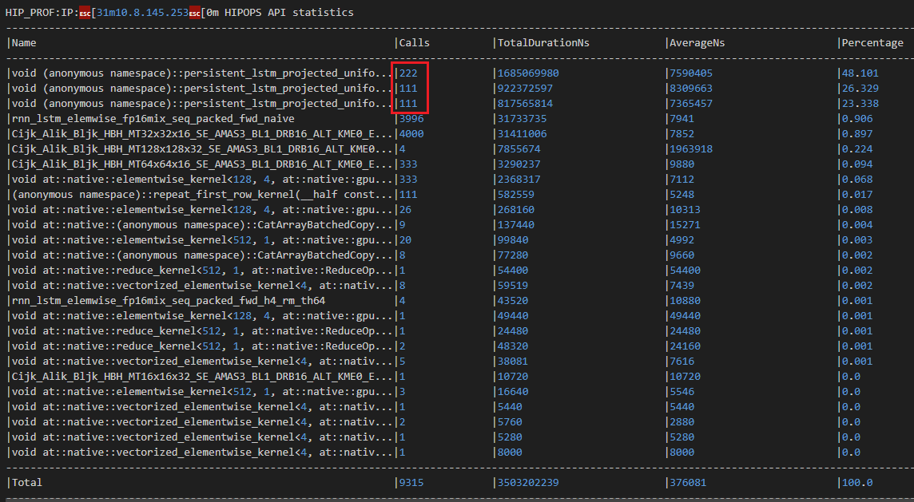

# Persistent LSTM HIP

面向海光 DCU / AMD ROCm 平台的固定形状 LSTM 推理优化项目。项目目标很直接：在不改上层 PyTorch 模型写法、不牺牲 FP16 推理精度的前提下，为当前业务里的 4 层 LSTM 回归模型提供一条专用 HIP 后端，让 `LSTM.py` 在 DCU 上跑得尽可能接近甚至追上 NVIDIA A10 上 cuDNN persistent LSTM 的表现。

## 背景

当前模型是一个固定形状的序列回归网络：

- 输入: `[batch=512, seq_len=1000, input_size=5]`
- LSTM: `num_layers=4, hidden_size=128, batch_first=True`
- 输出: 取最后一个 timestep 的 top-layer hidden，再接 `Linear(128 -> 24)`
- 推理精度: FP16


在 NVIDIA A10 上，原始 `LSTM.py` 可以直接命中 cuDNN 的 persistent LSTM kernel。测试中 A10 日志中 100 次迭代约 `2.12s`，吞吐约 `24125 samples/s`，profile 里主要耗时集中在 `RNN_blockPersist_fp_LSTM_HMMA` 和 Tensor Core GEMM 上，底层算子已经对 recurrent workload 做了深度优化。

在海光 DCU / ROCm K100_AI环境里，同一个 `LSTM.py` 直接运行的裸测大约在 `9s` 量级；开启 profiler 后，本仓库 `log/LSTM.log` 记录到 `10.23s`、约 `5003 samples/s`。这个差距主要来自底层 LSTM 算子实现差异：通用 ROCm 路径没有在这个固定 shape 上达到 A10/cuDNN persistent kernel 的效率。

这个项目就是为了解决这个问题：针对当前模型 shape 写专用 HIP 推理路径，把通用 LSTM 的调度、kernel launch 和 recurrent GEMV 开销压缩到更适合 DCU 的实现里。

## 当前结果

当前默认优化路径为 `projected + uniform batch + P4 shuffle recurrent kernel`。K100_AI最新测试结果为：

```text
backend: hip_specialized_4layer_regressor[auto]
accuracy_vs_native_lstm: max_abs=6.10352e-05, mean_abs=8.23538e-06, max_rel=0.130435
3.086296558380127
吞吐量(含batchsize): 16589.46216978994
```

相对原始 `LSTM.py` 已经有约 `3.3x` 加速。与原生 PyTorch LSTM 的 FP16 输出误差保持在正常量级。

原始 LSTM 日志截图：



优化后 HIP 日志截图：



最直观的差别：
1. LSTM.log 里的原始 LSTM.py 主要还是走通用 PyTorch/ROCm 路径，热点集中在 rnn_lstm_elemwise_fp16mix_seq_packed_fwd_naive 和一堆 GEMM kernel 上，说明它在做比较通用、比较碎的 LSTM 调度，原始日志里 API 调用特别多，hipExtModuleLaunchKernel 高到 88 万级，整体是“很多小 kernel + 很多调度开销”的形态。
2. LSTM-hip.log 里已经变成我们自己的专用 HIP 路径，最重的就是 3 个自定义 persistent_lstm_projected_uniform_* kernel，这说明 recurrent 部分已经被收敛成少量高占比 kernel 了，优化后日志总调用数降到 3 万级，launch 数量明显少很多。

性能对比表：

| 平台 / 路径 | 100 iter 时间 | 吞吐量，含 batchsize | 说明 |
| --- | ---: | ---: | --- |
| NVIDIA A10 原生 `LSTM.py` | 约 `2.12s` | 约 `24125 samples/s` | cuDNN persistent LSTM |
| BW10 原生 `LSTM.py` profiler 日志 | `14.89s` | `3438 samples/s` | 包含 profiler 开销 |
| K100_AI 原生 `LSTM.py` profiler 日志 | `10.23s` | `5003 samples/s` | 见 `log/LSTM.log`，包含 profiler 开销 |
| K100_AI HIP interleaved | 约 `18s` | 约 `2770 samples/s` | 早期 HIP 路径 |
| K100_AI uniform projected | 约 `5.5s` | 约 `9200 samples/s` | uniform batch + projected |
| K100_AI uniform projected P4 shuffle | `3.08s` | `16589 samples/s` | 当前默认最快路径 |

## 项目做了什么

本项目提供一个 PyTorch C++/HIP extension，可以从标准 `nn.LSTM + nn.Linear` 模型中读取权重，并在命中特定结构时自动替换为专用 HIP 后端。

当前重点优化的结构是：

- `input_size = 5`
- `hidden_size = 128`
- `num_layers = 4`
- `output_size = 24`
- `batch_first = True`
- FP16 inference
- 只需要最后一个 timestep 的 top-layer hidden 输出

如果没有命中特化结构，接口层仍保留 reference / fallback 路径，方便后续扩展其他 shape。

## 核心实现

### 权重打包

Python 侧会把 PyTorch LSTM 权重整理成 HIP kernel 更容易读取的布局：

- 合并 `bias_ih + bias_hh`
- 对 recurrent 权重做 pair packing
- 缓存已打包权重，避免每次 forward 重复整理
- 根据 tensor id、device、dtype、shape、stride、version 判断缓存是否失效

相关文件：

- `persistent_lstm_hip/persistent_lstm_hip/model.py`
- `persistent_lstm_hip/persistent_lstm_hip/packing.py`

### Projected 路径

当前最快主路径是 `projected` 后端。它把每层 LSTM 拆成两部分：

- input projection: 使用矩阵乘计算 `x @ W_ih.T + bias`
- recurrent recurrence: 使用自定义 HIP persistent kernel 跨 timestep 维护 hidden / cell

这样可以让大块 input projection 继续走高吞吐矩阵计算，而 recurrent 部分交给专门为 `hidden_size=128` 写的 HIP kernel。

### Uniform Batch Fast Path

当前 benchmark 输入是：

```python
x = torch.ones((512, 1000, 5), device="cuda:0", dtype=torch.float16)
```

也就是说 512 条 batch 完全相同，且初始 hidden / cell 也相同。因此 512 行输出在数学上也完全相同。项目会自动检测这种 uniform batch，只计算一条真实序列，再把第一行输出 repeat 回 `[512, 24]`。

这个优化不是近似，不改变数学结果。检测结果会按输入 tensor 缓存，warmup 后不会污染正式计时。

### P4 Shuffle Recurrent Kernel

早期 recurrent kernel 是“每个 hidden 单元一个线程，串行扫 128 个 hidden 值”。profile 显示这部分是 K100_AI 上的绝对瓶颈。

当前默认 P4 路径把每个 hidden 单元的 recurrent dot-product 拆成 4 个 partition 并行计算：

- 每个 hidden 使用 4 个 partition
- 每个 partition 负责一部分 recurrent pairs
- 使用 wave / warp shuffle 做 4 路归约
- 减少 shared memory 写读和同步成本

这一版把时间从约 `5.5s` 继续压到约 `3.08s`。

### Kernel Fusion

为了减少中间 tensor 和 kernel launch，项目还做了几处融合：

- layer0 的 `input_size=5` projection 融入第 0 层 recurrent kernel
- 最后一层 recurrent kernel 直接融合 `Linear(128 -> 24)`
- 自定义 `repeat_first_row` kernel 生成最终 `[512, 24]` 输出

### 可回退实验路径

项目中保留多个 backend 开关，便于性能对照：

- `interleaved`: 早期两段式 HIP kernel
- `monolithic`: 4 层合并 kernel 实验
- `projected`: 当前默认主路径
- `uniform_projected`: uniform batch 专用 projected 路径
- `uniform_projected_p4`: 当前默认最快 recurrent 路径
- `uniform_projected_p8`: 8 路 partition 实验，K100_AI 上实测更慢，默认关闭

## 目录结构

```text
.
├── LSTM.py
├── LSTM-hip.py
├── README.md
├── image
│   ├── image.png
│   ├── LSTM-log.png
│   └── LSTM-hip-log.png
├── log
│   ├── LSTM.log
│   └── LSTM-hip.log
└── persistent_lstm_hip
    ├── setup.py
    ├── pyproject.toml
    ├── benchmark_persistent_lstm.py
    ├── csrc
    │   ├── bindings.cpp
    │   ├── persistent_lstm_op.cpp
    │   ├── persistent_lstm_reference.cpp
    │   ├── persistent_lstm_hip.h
    │   └── persistent_lstm_hip.cu
    └── persistent_lstm_hip
        ├── __init__.py
        ├── api.py
        ├── extension.py
        ├── model.py
        ├── packing.py
        └── reference.py
```

## 构建方法

在 ROCm / HIP 环境中编译扩展：

```bash
cd persistent_lstm_hip
python setup.py build_ext --inplace
cd ..
```

`setup.py` 会在 HIP 构建时追加：

```text
--gpu-max-threads-per-block=512
```

这是为了匹配默认 P4 kernel 的 `512 threads/block` launch 配置。

## 运行 Benchmark

直接运行优化版本：

```bash
python LSTM-hip.py
```

打开 debug 信息：

```bash
PERSISTENT_LSTM_HIP_DEBUG=1 python LSTM-hip.py
```

只测试速度，不打印精度对比：

```bash
PERSISTENT_LSTM_HIP_ACCURACY=0 python LSTM-hip.py
```

禁用 HIP 后端，回到原生模型：

```bash
USE_PERSISTENT_LSTM_HIP=0 python LSTM-hip.py
```

## 在自己的模型中使用

如果模型结构类似：

```python
class LSTMRegressor(nn.Module):
    def __init__(self):
        super().__init__()
        self.lstm = nn.LSTM(
            input_size=5,
            hidden_size=128,
            num_layers=4,
            batch_first=True,
            dropout=0.2,
        )
        self.linear = nn.Linear(128, 24)

    def forward(self, x):
        out, _ = self.lstm(x)
        return self.linear(out[:, -1, :])
```

可以直接转换：

```python
from persistent_lstm_hip import convert_regressor_module

model = LSTMRegressor().to("cuda:0").half().eval()
model = convert_regressor_module(model).to("cuda:0").half().eval()
```

转换后仍然是一个 `nn.Module`，可以像普通 PyTorch 模型一样调用。

## 环境变量

| 变量 | 默认值 | 说明 |
| --- | --- | --- |
| `USE_PERSISTENT_LSTM_HIP` | `1` | 是否启用 HIP 转换 |
| `PERSISTENT_LSTM_HIP_BACKEND` | `auto` | 可选 `auto`、`projected`、`interleaved`、`monolithic` |
| `PERSISTENT_LSTM_HIP_DEBUG` | `0` | 打印实际 backend 和 fast path 命中情况 |
| `PERSISTENT_LSTM_HIP_ACCURACY` | `1` | 在 `LSTM-hip.py` 中打印原生 LSTM 精度对比 |
| `PERSISTENT_LSTM_HIP_UNIFORM_BATCH` | `auto` | 自动检测 uniform batch；可设 `0` 关闭 |
| `PERSISTENT_LSTM_HIP_UNIFORM_COMPUTE_BATCH` | `16` | uniform fast path fallback 计算 batch |
| `PERSISTENT_LSTM_HIP_UNIFORM_PROJECTED` | `1` | 启用 uniform projected 路径 |
| `PERSISTENT_LSTM_HIP_UNIFORM_PROJECTED_P4` | `1` | 启用当前默认 P4 recurrent kernel |
| `PERSISTENT_LSTM_HIP_UNIFORM_PROJECTED_P8` | `0` | 启用 P8 实验 kernel，K100_AI 上实测更慢 |
| `PERSISTENT_LSTM_HIP_UNIFORM_PROJECTED_VIRTUAL_BATCH` | `4` | uniform projected 的虚拟 block 数 |

## 日志说明

仓库保留了两份原始日志，方便复现实验口径：

- `log/LSTM.log`: 原始 `LSTM.py` 在 K100_AI / ROCm 上的 profiler 日志
- `log/LSTM-hip.log`: 当前优化版 `LSTM-hip.py` 在 K100_AI / ROCm 上的 profiler 日志

## 调优记录

几条关键结论：

- 早期 `interleaved` 路径比原生 DCU LSTM 慢，主要因为 recurrent GEMV 串行度高。
- uniform batch fast path 可以大幅减少重复 batch 计算，但 batch 缩太小会导致 GPU 占用不足。
- `projected` 路径比纯手写 GEMV 更适合当前 shape，因为 input projection 可以交给矩阵计算。
- P4 partition recurrent kernel 是当前最有效的优化，把 recurrent dot-product 从单线程串行拆成 4 路并行。
- P8 在 K100_AI 上更慢，说明更多线程不一定更好；同步、shared memory 和 occupancy 成本会抵消收益。
- shuffle 归约比 shared memory 归约更轻，当前默认使用 P4 shuffle。

## 后续方向

后续如果继续优化，可以考虑：

- 给 P4 recurrent kernel 进一步减少同步点
- 针对 wave64 做更细的 lane 分组和寄存器调度
- 评估是否能融合更多层间 projection
- 用 profiler 对比 P4 kernel 的 occupancy、VGPR、LDS 和内存带宽
- 为非 uniform batch 设计更通用的高吞吐路径

当前版本的重点是先把固定业务 shape 跑快，并保持和原生 PyTorch LSTM 的 FP16 输出一致性。
