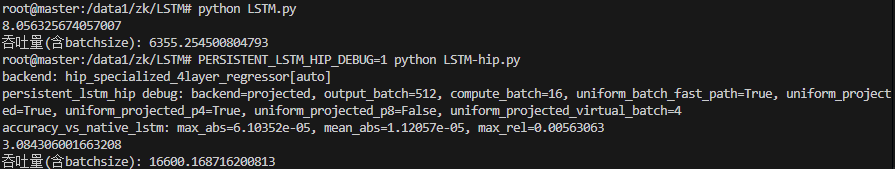

# Persistent LSTM HIP

面向海光 DCU / AMD ROCm 平台的 LSTM 推理优化项目。目标是在不改变上层 PyTorch 模型写法和 FP16 推理精度的前提下，为固定形状的 LSTM 回归模型提供专用 HIP 后端，让 `LSTM.py` 在 DCU 上获得接近甚至超过原生厂商 LSTM 算子的性能。

## 背景

当前业务模型是一个典型的序列回归网络：

- 输入: `[batch=512, seq_len=1000, input_size=5]`
- LSTM: `num_layers=4, hidden_size=128, batch_first=True`
- 输出: 取最后一个 timestep 的 top-layer hidden，再接 `Linear(128 -> 24)`
- 推理精度: FP16



在 NVIDIA A10 上，原始 `LSTM.py` 直接运行可以依赖 cuDNN 的 persistent LSTM kernel，日志中 100 次迭代约 `2.12s`，吞吐约 `24125 samples/s`。从 profile 看，核心耗时主要在 `RNN_blockPersist_fp_LSTM_HMMA` 和 Tensor Core GEMM 上，底层算子已经对这种 recurrent workload 做了比较充分的优化。

在海光 DCU / ROCm 环境中，直接运行同一个 `LSTM.py` 大约需要 `7s`。差距主要来自底层 LSTM 算子实现差异：原生路径没有在这个固定 shape 上达到 A10/cuDNN persistent kernel 的效果。这个项目就是为了解决这个问题：针对当前模型 shape 写一条专用 HIP 推理路径，把通用 LSTM 的开销收敛到更适合 DCU 的 kernel 结构里。

当前优化后，在 K100_AI 上 `LSTM-hip.py` 的 P4 shuffle 路径约 `3.08s`，吞吐约 `16608 samples/s`。相比 DCU 原生 `LSTM.py` 的约 `7s` 已经明显加速，同时精度误差保持在 FP16 量级。

## 项目做了什么

这个项目提供了一个 PyTorch C++/HIP extension，可以从标准 `nn.LSTM + nn.Linear` 模型中导出权重，并在命中特定结构时自动替换为专用 HIP 后端。

当前重点优化的结构是：

- `input_size = 5`
- `hidden_size = 128`
- `num_layers = 4`
- `output_size = 24`
- `batch_first = True`
- FP16 inference
- 只需要最后一个 timestep 的 top-layer hidden 输出

如果不命中特化结构，接口层仍保留 reference / fallback 路径，便于后续扩展其它 shape。

## 核心技术路线

### 1. 权重打包

Python 侧会把 PyTorch LSTM 权重整理成 HIP kernel 更容易读取的布局：

- 合并 `bias_ih + bias_hh`
- 对 recurrent 权重做 pair packing
- 缓存已经打包好的权重，避免每次 forward 重复整理
- 根据 tensor id、device、dtype、版本号判断缓存是否失效

相关文件：

- `persistent_lstm_hip/persistent_lstm_hip/model.py`
- `persistent_lstm_hip/persistent_lstm_hip/packing.py`

### 2. Projected 路径

当前最快路径是 `projected` 后端。它把每一层拆成两部分：

- input projection: 使用矩阵乘计算 `x @ W_ih.T + bias`
- recurrent recurrence: 使用自定义 HIP persistent kernel 跨 timestep 维护 hidden / cell

这样可以让大块 input projection 继续走高吞吐矩阵计算，而 recurrent 部分由专用 kernel 处理。

### 3. Uniform batch fast path

当前 benchmark 输入是：

```python
x = torch.ones((512, 1000, 5), device="cuda:0", dtype=torch.float16)
```

也就是说 512 条 batch 完全相同，且初始 hidden / cell 都相同。因此 512 行输出在数学上也完全相同。项目会自动检测这种 uniform batch，并只计算一条真实序列，再把第一行输出 repeat 回 `[512, 24]`。

这个优化不是近似，不改变数学结果。检测结果会按输入 tensor 缓存，warmup 后不会污染正式计时。

### 4. Uniform projected P4 recurrent kernel

最早的 recurrent kernel 是“每个 hidden 单元一个线程，串行扫 128 个 hidden 值”。profile 显示这部分是 K100_AI 上的绝对瓶颈。

当前默认 P4 路径把每个 hidden 单元的 recurrent dot-product 拆成 4 个线程并行计算：

- 每个 hidden 使用 4 个 partition
- 每个 partition 负责一部分 recurrent pairs
- 使用 wave / warp shuffle 做 4 路归约
- 减少 shared memory 写读和同步成本

这一版把时间从约 `5.5s` 继续压到约 `3.08s`。

### 5. Kernel fusion

为了减少不必要的中间 tensor 和 launch，项目还做了几处融合：

- layer0 的 `input_size=5` projection 融入第 0 层 recurrent kernel
- 最后一层 recurrent kernel 直接融合 `Linear(128 -> 24)`
- 自定义 `repeat_first_row` kernel 生成最终 `[512, 24]` 输出

### 6. 可回退实验路径

项目中保留了多个后端开关，便于做性能对照：

- `interleaved`: 早期两段式 HIP kernel
- `monolithic`: 4 层合并 kernel 实验
- `projected`: 当前默认主路径
- `uniform_projected`: uniform batch 专用 projected 路径
- `uniform_projected_p4`: 当前默认最快 recurrent 路径
- `uniform_projected_p8`: 8 路 partition 实验，实测在 K100_AI 上更慢，默认关闭

## 性能现状

以下数字来自当前测试过程，主要用于说明优化方向和量级。不同驱动、编译器、卡型、频率和 profiler 开关都会影响绝对值。

| 平台 / 路径 | 时间，100 iter | 吞吐，含 batchsize | 说明 |
| --- | ---: | ---: | --- |
| NVIDIA A10 原生 `LSTM.py` | `2.12s` | `24125 samples/s` | cuDNN persistent LSTM |
| K100_AI 原生 `LSTM.py` | 约 `7s` | 约 `7300 samples/s` | ROCm 原生路径 |
| K100_AI HIP interleaved | 约 `18s` | 约 `2770 samples/s` | 早期 HIP 路径 |
| K100_AI uniform projected | 约 `5.5s` | 约 `9200 samples/s` | uniform batch + projected |
| K100_AI uniform projected P4 shuffle | `3.08s` | `16608 samples/s` | 当前默认最快路径 |

精度对比使用同权重原生 PyTorch `nn.LSTM + Linear` eval 输出作为基线，典型误差为 FP16 量级，例如：

```text
accuracy_vs_native_lstm: max_abs=6.10352e-05, mean_abs=..., max_rel=...
```

## 目录结构

```text
.
├── LSTM.py
├── LSTM-hip.py
├── README.md
└── persistent_lstm_hip
    ├── setup.py
    ├── pyproject.toml
    ├── benchmark_persistent_lstm.py
    ├── csrc
    │   ├── bindings.cpp
    │   ├── persistent_lstm_op.cpp
    │   ├── persistent_lstm_reference.cpp
    │   ├── persistent_lstm_hip.h
    │   └── persistent_lstm_hip.cu
    └── persistent_lstm_hip
        ├── __init__.py
        ├── api.py
        ├── extension.py
        ├── model.py
        ├── packing.py
        └── reference.py
```

## 构建方法

在 ROCm / HIP 环境中编译扩展：

```bash
cd persistent_lstm_hip
python setup.py build_ext --inplace
cd ..
```

`setup.py` 会在 HIP 构建时追加：

```text
--gpu-max-threads-per-block=512
```

这是为了匹配默认 P4 kernel 的 `512 threads/block` launch 配置。

## 运行 benchmark

直接运行优化版本：

```bash
python LSTM-hip.py
```

打开 debug 信息：

```bash
PERSISTENT_LSTM_HIP_DEBUG=1 python LSTM-hip.py
```

典型 debug 输出：

```text
backend: hip_specialized_4layer_regressor[auto]
persistent_lstm_hip debug: backend=projected, output_batch=512, compute_batch=16, uniform_batch_fast_path=True, uniform_projected=True, uniform_projected_p4=True, uniform_projected_p8=False, uniform_projected_virtual_batch=4
```

只测试速度，不打印精度对比：

```bash
PERSISTENT_LSTM_HIP_ACCURACY=0 python LSTM-hip.py
```

禁用 HIP 后端，回到原生模型：

```bash
USE_PERSISTENT_LSTM_HIP=0 python LSTM-hip.py
```

## 在自己的模型中使用

如果模型结构类似：

```python
class LSTMRegressor(nn.Module):
    def __init__(self):
        super().__init__()
        self.lstm = nn.LSTM(
            input_size=5,
            hidden_size=128,
            num_layers=4,
            batch_first=True,
            dropout=0.2,
        )
        self.linear = nn.Linear(128, 24)

    def forward(self, x):
        out, _ = self.lstm(x)
        return self.linear(out[:, -1, :])
```

可以直接转换：

```python
from persistent_lstm_hip import convert_regressor_module

model = LSTMRegressor().to("cuda:0").half().eval()
model = convert_regressor_module(model).to("cuda:0").half().eval()
```

转换后仍然是一个 `nn.Module`，可以像普通 PyTorch 模型一样调用。

## 环境变量

| 变量 | 默认值 | 说明 |
| --- | --- | --- |
| `USE_PERSISTENT_LSTM_HIP` | `1` | 是否启用 HIP 转换 |
| `PERSISTENT_LSTM_HIP_BACKEND` | `auto` | 可选 `auto`、`projected`、`interleaved`、`monolithic` |
| `PERSISTENT_LSTM_HIP_DEBUG` | `0` | 打印实际 backend 和 fast path 命中情况 |
| `PERSISTENT_LSTM_HIP_ACCURACY` | `1` | 在 `LSTM-hip.py` 中打印原生 LSTM 精度对比 |
| `PERSISTENT_LSTM_HIP_UNIFORM_BATCH` | `auto` | 自动检测 uniform batch；可设 `0` 关闭 |
| `PERSISTENT_LSTM_HIP_UNIFORM_COMPUTE_BATCH` | `16` | uniform fast path fallback 计算 batch |
| `PERSISTENT_LSTM_HIP_UNIFORM_PROJECTED` | `1` | 启用 uniform projected 路径 |
| `PERSISTENT_LSTM_HIP_UNIFORM_PROJECTED_P4` | `1` | 启用当前默认 P4 recurrent kernel |
| `PERSISTENT_LSTM_HIP_UNIFORM_PROJECTED_P8` | `0` | 启用 P8 实验 kernel；K100_AI 上实测更慢 |
| `PERSISTENT_LSTM_HIP_UNIFORM_PROJECTED_VIRTUAL_BATCH` | `4` | uniform projected 的虚拟 block 数 |

## 调优记录

几条关键结论：

- 早期 `interleaved` 路径比原生 DCU LSTM 慢，主要因为 recurrent GEMV 串行度高。
- uniform batch fast path 可以大幅减少重复 batch 计算，但 batch 缩太小会导致 GPU 占用不足。
- `projected` 路径比纯手写 GEMV 更适合当前 shape，因为 input projection 可以交给矩阵计算。
- P4 partition recurrent kernel 是当前最有效的优化，把 recurrent dot-product 从单线程串行拆成 4 路并行。
- P8 在 K100_AI 上更慢，说明更多线程并不一定更好；同步、shared memory 和 occupancy 成本会抵消收益。
- shuffle 归约比 shared memory 归约更轻，当前默认使用 P4 shuffle。

## 后续方向

后续如果继续优化，可以考虑：

- 为 P4 recurrent kernel 进一步减少同步点
- 针对 wave64 做更细的 lane 分组和寄存器调度
- 评估是否能融合更多层间 projection
- 用 profiler 对比 P4 kernel 的 occupancy、VGPR、LDS、内存带宽
- 为非 uniform batch 设计更通用的高吞吐路径

当前版本的重点是先把固定业务 shape 跑快，并保持和原生 PyTorch LSTM 的 FP16 输出一致性。
