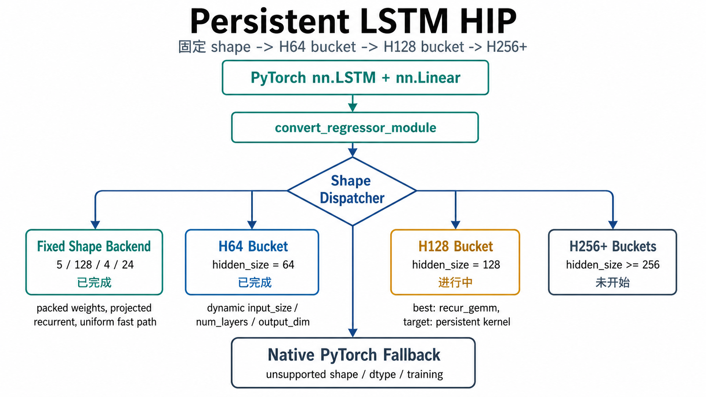

# Persistent LSTM HIP

面向海光 DCU / AMD ROCm 的 LSTM 推理优化项目。

这个项目的目标不是替换 PyTorch 的所有 RNN 能力，而是针对业务里反复出现的
`nn.LSTM + nn.Linear` 回归结构，做一条可持续扩展的 HIP 后端：先吃透固定形状，
再按 `hidden_size` 分桶，把 NVIDIA cuDNN persistent RNN 那类思路逐步迁移到
ROCm/HIP 环境里。

当前重点是 FP16 inference。训练、反向传播、FP32/BF16 路径还没有纳入当前优化范围。

## 当前阶段

| 阶段 | 范围 | 状态 | 说明 |
| --- | --- | --- | --- |
| 固定形状 | `input=5, hidden=128, layers=4, output=24` | 已完成 | 最早的业务 shape，做了最深的手工特化 |
| H64 bucket | `hidden_size=64`，`input_size/num_layers/output_dim` 动态 | 已完成 | 非全 1 输入也走 HIP 优化路径 |
| H128 bucket | `hidden_size=128`，`input_size/num_layers/output_dim` 动态 | 进行中 | 当前有最快 `recur_gemm` 路径和少 kernel 的 `persistent_scalar` 研究路径 |
| H256+ bucket | `hidden_size>=256` | 未开始 | 等 H128 路线稳定后再扩展 |

## 架构



对上层代码来说，入口保持简单：

```python
from persistent_lstm_hip import convert_regressor_module

model = LSTMRegressor().to("cuda:0").half().eval()
model = convert_regressor_module(model)
out = model(x)
```

dispatcher 会根据模型结构选择后端。没有命中 HIP 专用路径时，模型自动回到原生
PyTorch，不会因为 shape 不匹配而不可用。

## 核心实现

### 1. 固定形状后端

最早优化的是固定业务结构：

```text
batch       = 512
seq_len     = 1000
input_size  = 5
hidden_size = 128
num_layers  = 4
output_dim  = 24
dtype       = fp16
```

这条路径做了最强特化：

- Python 侧静态识别 4 层 LSTM + Linear。
- recurrent 权重按 kernel 访问方式预打包。
- input projection 交给矩阵乘，recurrent 部分交给自定义 HIP kernel。
- P4 partition 把每个 hidden 的 recurrent dot-product 拆成 4 路并行，再用 shuffle 归约。
- 对全 batch 输入完全一致的场景，启用 uniform batch fast path，减少重复计算。
- 最后一层只保留最后一个 timestep，再接 `Linear(128 -> 24)`。

这条路径快，但它依赖固定 shape，所以不是后续通用化的最终形态。

### 2. H64 bucket

H64 是当前已经完成的通用 bucket。它只固定 `hidden_size == 64`，其余保持动态：

```text
input_size  = dynamic
num_layers  = dynamic
output_dim  = dynamic
batch_size  = dynamic
seq_len     = dynamic
```

核心思路：

- 每层先用 `torch::matmul` 计算 input projection。
- LSTM bias 合并后传入 recurrent kernel，减少额外 elementwise kernel。
- recurrent kernel 内部使用 P4 partition，4 个线程协作计算一个 hidden 单元。
- recurrent 权重在 kernel 内按固定 `hidden=64` 展开访问。
- 中间层写完整序列，最后一层只写最后 hidden，再接动态 Linear。
- generic uniform batch 默认关闭，因此非全 1 输入也能使用这条 HIP 路径。

实测 `7/64/2/16` 已经从原生 PyTorch 约 `1.94s` 降到约 `0.89s`。

### 3. H128 bucket

H128 是当前正在做的阶段性目标。约束和 H64 一样：

```text
hidden_size = 128 fixed
input_size  = dynamic
num_layers  = dynamic
output_dim  = dynamic
```

现在保留两条有价值的路径：

| 模式 | 环境变量 | 作用 |
| --- | --- | --- |
| `native` | 默认 | H128 默认回到 PyTorch，作为稳定 baseline |
| `best` / `recur_gemm` | `PERSISTENT_LSTM_HIP_H128_MODE=best` | 当前最快 H128 路径，用 GEMM 做 recurrent scan，再用 HIP pointwise 更新门控 |
| `persistent_scalar` | `PERSISTENT_LSTM_HIP_H128_MODE=persistent_scalar` | 少 kernel 的 persistent recurrent 研究路径，kernel 启动次数少，但矩阵吞吐还不够 |

`recur_gemm` 当前能跑到比原生 LSTM 更快的区间，但它会重新引入大量小 GEMM kernel。
所以它是当前 H128 的速度基线，不是最终答案。H128 后续真正要解决的是：

- 保持 `input_size/num_layers/output_dim` 动态。
- 保持 H128 专用 recurrent kernel。
- 逐步减少每个 timestep 的 kernel 启动。
- 让 persistent 路径接近 GEMM 路径的吞吐。

## 性能记录

以下是当前项目里有代表性的结果，数字来自 K100_AI / ROCm 环境，主要用于说明阶段进展。

| 路径 | Shape | 时间 | 吞吐量 | 状态 |
| --- | --- | ---: | ---: | --- |
| 原生 PyTorch LSTM | `5/128/4/24` | 约 `9s` | 约 `5600 samples/s` | baseline |
| 固定形状 HIP | `5/128/4/24` | 约 `3.08s` | 约 `16600 samples/s` | 已完成 |
| 原生 PyTorch LSTM | `7/64/2/16` | 约 `1.94s` | 约 `26384 samples/s` | baseline |
| H64 HIP bucket | `7/64/2/16` | 约 `0.89s` | 约 `57537 samples/s` | 已完成 |
| 原生 PyTorch LSTM | `7/128/2/16` | 约 `3.94s` 到 `4.07s` | 约 `12500` 到 `13000 samples/s` | H128 baseline |
| H128 `recur_gemm` | `7/128/2/16` | 约 `2.9s` 到 `4.1s` | 最高约 `15954 samples/s` | 当前最快 |
| H128 `persistent_scalar` | `7/128/2/16` | 约 `5.86s` | 约 `8730 samples/s` | 少 kernel 研究路径 |

## 使用

构建扩展：

```bash
cd persistent_lstm_hip
python setup.py build_ext --inplace
cd ..
```

运行原生 baseline：

```bash
python LSTM.py
```

运行 HIP 包装版本：

```bash
python LSTM-hip.py
```

打印实际命中的后端：

```bash
PERSISTENT_LSTM_HIP_DEBUG=1 python LSTM-hip.py
```

测试 H128 当前最快路径：

```bash
PERSISTENT_LSTM_HIP_DEBUG=1 \
PERSISTENT_LSTM_HIP_H128_MODE=best \
python LSTM-hip.py
```

测试 H128 persistent scalar 路径：

```bash
PERSISTENT_LSTM_HIP_DEBUG=1 \
PERSISTENT_LSTM_HIP_H128_MODE=persistent_scalar \
python LSTM-hip.py
```

关闭 HIP 转换，强制回到 PyTorch：

```bash
USE_PERSISTENT_LSTM_HIP=0 python LSTM-hip.py
```

## 环境变量

| 变量 | 默认值 | 说明 |
| --- | --- | --- |
| `USE_PERSISTENT_LSTM_HIP` | `1` | 是否启用 HIP 模型转换 |
| `PERSISTENT_LSTM_HIP_DEBUG` | `0` | 打印实际 backend、bucket、partition 等信息 |
| `PERSISTENT_LSTM_HIP_ACCURACY` | `1` | `LSTM-hip.py` 中是否和原生 LSTM 做精度对比 |
| `PERSISTENT_LSTM_HIP_GENERIC_PROJECTED` | `1` | 是否启用 generic projected / hidden bucket 路径 |
| `PERSISTENT_LSTM_HIP_GENERIC_UNIFORM_BATCH` | `0` | generic 路径是否启用 uniform batch fast path，默认关闭 |
| `PERSISTENT_LSTM_HIP_H128_MODE` | `native` | H128 路径选择：`native`、`best`、`recur_gemm`、`persistent_scalar` |
| `PERSISTENT_LSTM_HIP_BACKEND` | `auto` | 固定形状后端选择，通常保持 `auto` |

## 目录结构

```text
.
├── LSTM.py
├── LSTM-hip.py
├── README.md
└── persistent_lstm_hip
    ├── setup.py
    ├── csrc
    │   ├── bindings.cpp
    │   ├── persistent_lstm_op.cpp
    │   ├── persistent_lstm_hip.h
    │   └── persistent_lstm_hip.cu
    └── persistent_lstm_hip
        ├── api.py
        ├── extension.py
        ├── model.py
        ├── packing.py
        └── reference.py
```

## 路线图

1. 收敛 H128：把 `recur_gemm` 作为速度 baseline，把 `persistent_scalar` 作为少 kernel baseline。
2. 继续分析 H128 hipprof/PMC：重点看 recurrent 矩阵吞吐、同步开销、寄存器压力和 kernel launch 数。
3. 设计 H128 下一版 persistent kernel：目标是减少启动次数，同时接近 GEMM 的有效吞吐。
4. H128 稳定后扩展到 H256 bucket。
5. 后续再考虑 BF16/FP32、更多 shape、更多硬件上的自动选择策略。
